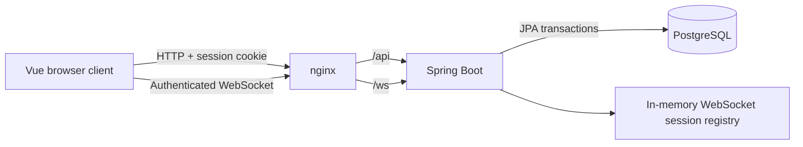

# GovChat

A small, secure, real-time one-to-one messaging application built for the GovTech Senior Full Stack Engineer take-home assessment.

GovChat uses Vue 3, Spring Boot, native WebSockets, and PostgreSQL. The messaging core is implemented directly on Spring's low-level `TextWebSocketHandler`.

## What is included

- Account registration and session-based login
- BCrypt password hashing
- HTTP-only authentication cookies and CSRF protection
- One-to-one private conversations
- Real-time delivery across browser sessions
- Persisted and reloadable message history
- Idempotent message submission using client-generated IDs
- Multiple active tabs per authenticated user
- Flyway-managed PostgreSQL schema
- OpenAPI/Swagger documentation for HTTP endpoints
- Containerized frontend, backend, and database
- Responsive Vue 3 interface
- Unit tests around validation, authentication, and principal-derived authorization

## Quick start with Docker

### Prerequisites

- Docker Desktop or Docker Engine
- Docker Compose v2

No local Java, Gradle, Node.js, npm, or PostgreSQL installation is required for this workflow.

### 1. Build and start

From the repository root:

```bash
docker compose up --build
```

To run in the background:

```bash
docker compose up --build -d
```

### 2. Open the application

Visit [http://localhost:8088](http://localhost:8088).

### 3. Demonstrate real-time messaging

Create two accounts in independent browser sessions because ordinary tabs share the same authentication cookie. For example:

- Create the first account in a normal browser window
- Create the second account in a private/incognito window or a different browser

Use the **Create account** tab in each session. After registration, select the other user and send a message. It should appear immediately in both sessions. Refresh either browser to demonstrate that history is persisted in PostgreSQL.

### 4. Stop the application

```bash
docker compose down
```

Messages and accounts remain in the named PostgreSQL volume.

To remove the database volume and return to an empty state, use:

```bash
docker compose down -v
```

> **Warning:** `-v` permanently deletes locally registered accounts and message history.

## Architecture



The frontend and backend are served through one browser origin. nginx serves the Vue bundle and proxies `/api` and `/ws` to Spring Boot. This avoids production CORS complexity while retaining a convenient Vite proxy for development.

### Repository structure

```text
MessagingApp/
├── backend/
│   ├── src/main/java/com/govtech/messaging/
│   │   ├── auth/       # Spring Security, login, registration and principals
│   │   ├── config/     # HTTP configuration and API error handling
│   │   ├── message/    # Message persistence and history
│   │   ├── realtime/   # Transport, command routing, publishing and session registry
│   │   └── user/       # User persistence and HTTP representation
│   ├── src/main/resources/db/migration/
│   ├── build.gradle.kts
│   └── Dockerfile
├── frontend/
│   ├── src/
│   │   ├── api/          # Shared HTTP helpers
│   │   ├── components/   # Authentication, sidebar, conversation and composer UI
│   │   ├── composables/  # Authentication and real-time messaging state
│   │   ├── App.vue       # Root screen composition
│   │   └── types.ts      # API and WebSocket event contracts
│   ├── nginx.conf
│   └── Dockerfile
├── compose.yaml
└── README.md
```

## Authentication and authorization

Authentication is part of the existing Spring Boot application rather than a separate microservice. For this time-boxed MVP, a modular monolith avoids introducing token signing, service-to-service trust, extra failure modes, and another deployment unit.

The flow is:

1. Vue requests a CSRF token from `GET /api/auth/csrf`.
2. Credentials are submitted to `POST /api/auth/login`.
3. Spring Security validates the BCrypt hash.
4. The authenticated `SecurityContext` is stored in the HTTP session.
5. The browser receives an HTTP-only, `SameSite=Lax` `JSESSIONID` cookie.
6. That cookie authenticates subsequent REST requests and the WebSocket upgrade request.

The message-history API accepts only a peer ID:

```http
GET /api/messages?peerId=<user-uuid>
```

The caller never submits its own identity. The controller obtains it from `@AuthenticationPrincipal`.

Likewise, WebSocket commands contain no sender ID. The handler obtains the authenticated user from `WebSocketSession#getPrincipal()`. Altering JSON or URL parameters therefore cannot turn Alice into Bob.

Implemented security controls include:

- BCrypt password storage
- Generic invalid-login responses to reduce username enumeration
- Session fixation protection
- HTTP-only and `SameSite=Lax` session cookie
- CSRF protection on registration, login, and logout
- Strict WebSocket origin configuration
- Principal-derived REST and WebSocket authorization
- Database uniqueness enforcement for concurrent registrations

For an internet-facing production deployment, enable TLS and secure cookies, add login/registration rate limits, use managed secrets, introduce audit events, and store sessions in a shared system such as Redis when horizontally scaling.

## Real-time messaging design

The WebSocket endpoint is:

```text
/ws
```

It requires an authenticated HTTP session and an allowed `Origin` during the upgrade.

### Client command

```json
{
  "type": "SEND_MESSAGE",
  "clientMessageId": "7ef1c305-c725-4ab5-a224-fdc68ddab10e",
  "recipientId": "22222222-2222-2222-2222-222222222222",
  "content": "Hello"
}
```

### Server event

```json
{
  "type": "MESSAGE",
  "message": {
    "id": "8ee55874-f847-416a-a0e0-9cf2beb4b9a6",
    "clientMessageId": "7ef1c305-c725-4ab5-a224-fdc68ddab10e",
    "senderId": "11111111-1111-1111-1111-111111111111",
    "recipientId": "22222222-2222-2222-2222-222222222222",
    "content": "Hello",
    "sentAt": "2026-09-01T05:10:22.396Z"
  },
  "error": null
}
```

Other event types are `CONNECTED` and `ERROR`.

The transport handler only owns the WebSocket lifecycle. `RealtimeCommandService`
dispatches commands, `RealtimePublisher` performs per-user delivery, and
`WebSocketSessionRegistry` owns the thread-safe user-to-session map. This keeps
new commands such as typing or read receipts out of the transport layer.

### Delivery and retry behavior

The server commits a message before publishing it to connected sessions. If the network drops after the commit but before the sender receives the event, the client can safely retry with the same `clientMessageId`.

The database constraint below prevents duplicate messages:

```text
UNIQUE (sender_id, client_message_id)
```

REST history is the recovery path for events missed while a user is offline or disconnected.

## HTTP API

| Method | Endpoint | Authentication | Purpose |
| --- | --- | --- | --- |
| `GET` | `/api/auth/csrf` | Public | Obtain a CSRF token |
| `POST` | `/api/auth/register` | Public + CSRF | Create a local account |
| `POST` | `/api/auth/login` | Public + CSRF | Authenticate and create a session |
| `GET` | `/api/auth/me` | Required | Restore the current user |
| `POST` | `/api/auth/logout` | Required + CSRF | Invalidate the session |
| `GET` | `/api/users` | Required | List available conversation peers |
| `GET` | `/api/messages?peerId=...` | Required | Load one-to-one history |

When running Spring Boot directly, API documentation is available at:

- Swagger UI: [http://localhost:8080/swagger-ui.html](http://localhost:8080/swagger-ui.html)
- OpenAPI JSON: [http://localhost:8080/v3/api-docs](http://localhost:8080/v3/api-docs)
- Health: [http://localhost:8080/actuator/health](http://localhost:8080/actuator/health)

The Docker setup intentionally exposes only `8088`; the backend remains internal to the Compose network.

## Local development

Use this workflow for faster iteration and frontend hot reload.

### Prerequisites

- Java 21
- Node.js 24 or a compatible modern Node.js release
- Docker Compose for PostgreSQL

The repository includes the Gradle Wrapper, so a global Gradle installation is unnecessary.

### 1. Start PostgreSQL

```bash
docker compose -f compose.yaml -f compose.dev.yaml up -d database
```

### 2. Start Spring Boot

```bash
cd backend
./gradlew bootRun
```

The development override publishes PostgreSQL on `localhost:5432`. The default local database settings match the Compose database credentials.

In IntelliJ IDEA, import `backend/build.gradle.kts` as the Gradle project and select Java 21 as the Gradle JVM.

### 3. Start Vue

In a second terminal:

```bash
cd frontend
npm install
npm run dev
```

Open [http://localhost:5173](http://localhost:5173). Vite proxies `/api` and `/ws` to Spring Boot on port `8080`.

## Build and test

Backend:

```bash
cd backend
./gradlew clean test
./gradlew bootJar
```

Frontend:

```bash
cd frontend
npm ci
npm run build
```

Full production-style verification:

```bash
docker compose down
docker compose up --build
```

## Troubleshooting

### Port `8088` is already in use

Stop the conflicting process or change the frontend mapping in `compose.yaml`:

```yaml
ports:
  - "8090:80"
```

Then open `http://localhost:8090`.

### Login returns `403 Forbidden`

Hard-refresh the page so the application obtains a new CSRF token. The frontend also refreshes expired CSRF state and retries authentication once.

### Login succeeds in one tab and changes another tab

This is expected: tabs in the same browser profile share the session cookie. Use a private window or a different browser to test two users simultaneously.

### Reset local data

```bash
docker compose down -v
docker compose up --build
```

This is destructive and removes all local message and account data.

### Inspect service state

```bash
docker compose ps
docker compose logs -f backend
docker compose logs -f frontend
```

## License and assessment use

This repository is an assessment project and is not presented as a production-ready messaging service. The production path is documented to make the remaining engineering work and operational risks explicit.
